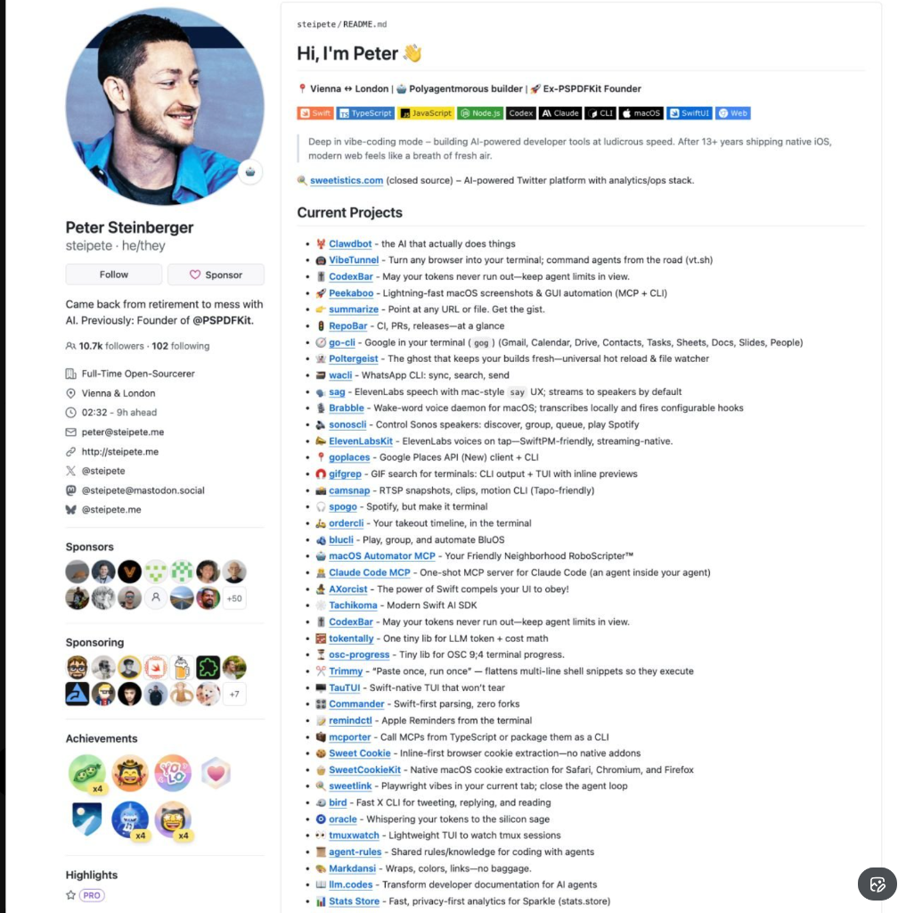

  
  
  <h1>Luis Sambrano</h1>
  
<strong>Software Engineer & System Architect</strong>

  
  

    
    
    
    
    
  

  

    Building high-performance, intelligent systems. Focused on <strong>AI Agents</strong>, <strong>Real-time Architectures</strong>, and <strong>Secure Data Platforms</strong>.
    Currently re-engineering the digital infrastructure for massive scale intelligence.
  

 

## Current Projects

- 🔭 **M&T Venezuela System**: A "Unicorn-Tier" distributed intelligence platform.
- 🔐 **Security & Identity**: Implementing MFA, Anti-Bot shields, and military-grade encryption standards.
- ⚡ **Neural Consoles**: Developing AI-powered interfaces for real-time data ingestion and analysis.

---

## ⚡ Stats

  
  

---

  

