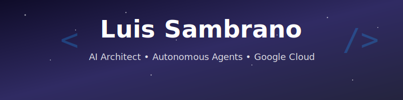

<!--
  Luis Sambrano | AI System Architect & Autonomous Agent Builder
  Specializing in Agentic AI, Multi-Agent Orchestration, and Enterprise AI Workspaces.
-->

  <!-- HERO SECTION: DYNAMIC ATMOSPHERE -->
  

  <!-- TRANSPARENT TITLE (KEPT AS REQUESTED) -->
  

  <!-- SOCIAL ICONS REMOVED -->
   

  <!-- AUTHORITY STATS -->

 

<!-- FEATURED PROJECTS -->

## 🚀 Featured Projects

  <table>
    <tr>
      <th width="300">Antigravity Config</th>
      <th width="300">Puente Fintech</th>
      <th width="300">Venezuela News</th>
    </tr>
    <tr>
      <td align="center">
        
          
        The ultimate <b>Gemini/Cursor configuration</b> for AI Agents. 100+ skills, Prompts, and Rules.
      </td>
      <td align="center">
        
          
        <b>P2P Remittances</b> on Celo Blockchain. React Native + Solidity.
      </td>
      <td align="center">
        
          
        <b>M&TVenezuela</b>: AI-driven platform for historical memory and truth verification.
      </td>
      <td align="center">
        
          
        <b>Badge Scanner</b>: Detect unused GitHub Achievements & Stats. Next.js 14 + GraphQL.
      </td>
    </tr>
  </table>

 

<!-- TECH STACK & SKILLS -->

## 🛠️ Tech Stack & Skills

<h3>🤖 AI & Orchestration</h3>

  

<h3>💻 Full Stack</h3>

  

<h3>☁️ Cloud & DevOps</h3>

  

 

<!-- DYNAMIC STATS (Auto-Updates) -->

  
  

 

<!-- GITHUB ACTIVITY -->

## 📊 GitHub Activity

  

    <!-- Stats Card Removed (Unstable) -->
    
     
    <!-- SNAKE ANIMATION -->
    
  

---

<!-- CTA SECTION -->

## 🚀 Let's Build the Future

I'm currently looking for **ambitious projects** and **AI-driven collaborations**.  
_If you have a vision, let's turn it into code._

  
  
  

 

<!-- FOOTER: DYNAMIC CLOSURE -->

  
   
  ⭐ <a href="https://github.com/LuisSambrano/antigravity-config">Star my projects</a> if you find them useful!

