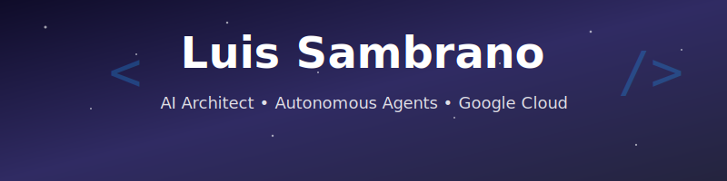

<!--
  Luis Sambrano | Software Engineer & System Architect
  Specializing in Full-Stack Development, Distributed Systems, and AI Engineering.
-->

  <!-- HERO SECTION: DYNAMIC ATMOSPHERE -->
  

  <!-- MINIMALIST TITLE -->
  

   

  <!-- AUTHORITY STATS -->

 

 

 

<!-- FEATURED PROJECTS -->

## Featured Projects

  <table>
    <tr>
      <th width="200">Antigravity Config</th>
      <th width="200">Puente Fintech</th>
      <th width="200">Libertad VZLA</th>
      <th width="200">Bolívar Stablecoin</th>
    </tr>
    <tr>
      <td align="center">
        
          
        <b>Development Configuration</b>. Standardized protocols, engineering workflows, and automation rules for AI-assisted development (Cursor/Gemini).
      </td>
      <td align="center">
        
          
        <b>P2P Remittances</b>. Decentralized app on Celo L2 built with Next.js, Privy (Non-custodial wallets), and SocialConnect.
      </td>
      <td align="center">
        
          
        <b>Full-Stack News Platform</b>. Features strict SSR, Server Actions, progressive scrollytelling, and a robust editorial CMS backed by Supabase.
      </td>
      <td align="center">
        
          
        <b>Stablecoin Research</b>. Open-source research assessing the technical, regulatory, and economic viability of a Venezuelan Bolivar-pegged stablecoin.
      </td>
    </tr>
    <tr>
      <th width="200">Invoice SaaS</th>
      <th width="200">n8n Automations</th>
      <th width="200"></th>
      <th width="200"></th>
    </tr>
    <tr>
      <td align="center">
        
          
        <b>Invoice Automation</b>. B2B SaaS architecture for automated invoice processing and automated financial workflows.
      </td>
      <td align="center">
        
          
        <b>AI Automations</b>. Advanced automated workflows connecting LLMs, CRMs, and internal APIs using n8n and MCP.
      </td>
      <td align="center"></td>
      <td align="center"></td>
    </tr>
  </table>

 

<!-- TECH STACK & SKILLS -->

## Tech Stack

<h3>Engineering & AI</h3>

  

<h3>Full Stack Ecosystem</h3>

  

<h3>Cloud & DevOps</h3>

  

 

<!-- DYNAMIC STATS (Auto-Updates) -->

  
  

 

  

 

 

<!-- GITHUB ACTIVITY -->

## GitHub Activity

  

    
     
    <!-- SNAKE ANIMATION -->
    
  

---

<!-- CONTACT SECTION -->

## Contact & Collaboration

I'm currently open for **engineering challenges** and **technical collaborations**.  
_Let's build scalable software together._

  
  

 

<!-- FOOTER: DYNAMIC CLOSURE -->

  

